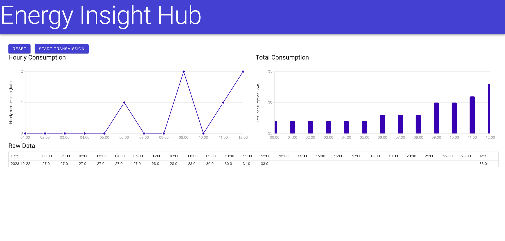

# Table of Contents
1. [Introduction](#introduction)
2. [System Requirements](#system-requirements)
3. [Installation Instructions](#installation-instructions)
   1. Step 1: [Install Python](##step-1-install-python)
   2. Step 2: [Install pip](##step-2-install-pip)
   3. Step 3: [Install Required Libraries](##step-3-install-required-libraries)
4. [User Interface Overview](#user-interface-overview)
5. [Usage Instructions](#usage-instructions)
6. [Troubleshooting](#troubleshooting)

# Introduction

Welcome to the Energy Insight Hub user manual! This manual provides
guidance on installing and using the web app, which serves as a proof of
concept for an energy meter reader. The web app showcases the technology
involved in transmitting images of a meter, extracting readings from the
images, and displaying the data in a live dashboard.

# System Requirements

**Operating System**: Windows (only supported platform)

**Software**: Python, pip

**Web Browser**: Firefox, Chrome (recommended)

# Installation Instructions

## Step 1: Install Python

1.  Download and install the latest version of Python for Windows from
    [Python Downloads](https://www.python.org/downloads/windows/).

2.  Run the downloaded installer.

3.  During installation, ensure to check the box that says "Add Python
    to PATH".

4.  Follow the prompts to complete the installation.

5.  Once installed, open the Command Prompt and type \`python
    --version\` to verify the installation. You should see the installed
    Python version.

## Step 2: Install pip

1.  Download the pip [installation
    script](https://bootstrap.pypa.io/get-pip.py).

2.  Open Command prompt, cd to the folder containing the get-pip.py file
    and run \`python get-pip.py\`.

3.  After installation, verify that pip is installed by typing \`pip
    --version\`.

## Step 3: Install Required Libraries

1.  Open Command Prompt.

2.  Navigate to the directory containing the web app files.

3.  Run the following command to install the required libraries using
    pip: \`pip install opencv-python imageio pytesseract watchdog\`

# User Interface Overview

The Energy Insight Hub web app features a live dashboard with the
following components:

- Two charts displaying energy readings.

- A datagrid showing detailed readings.

- Two Buttons:

  - Reset: Resets the database to default values.

  - Start Transmission: Simulates the transmission of Data

# Usage Instructions

1.  To start using the web app, run the EnergyInsightHub.exe file and
    note the address hosting the web app.

2.  Open a web browser and navigate to the hosting address.

3.  Click the "Start Transmission" button to simulate the transmission
    of data.

4.  If needed, click the "Reset" button to reset the database to default
    values.

# Troubleshooting

If you encounter any issues during installation or usage

- Ensure that Python and pip are installed correctly.

- Check that the required Python libraries (opencv-python, imageio,
  pytesseract, watchdog) are installed.

- If Tesseract is not in the default location, edit the .py script to
  specify its location.
